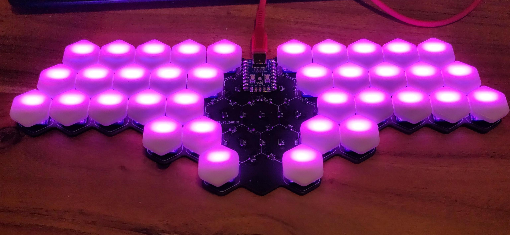

# Hexatana
Hexatana is a 36 katana-inspired keyboard designed around [hexagonal keycaps](https://hw.s-ol.nu/HEX-keycaps/).


# Soldering
## MCU
The first step is to solder the RP2040 to the top center of the PCB.
You can use pin headers to align the MCU on the solder pads.
The orientation if the MCU should be such that the USB-C port is on the top side of the main PCB.
The bottom side of the main PCB has six katanas printed in its center.
So to solder the MCU in place, put the main PCB on your soldering surface, such that you do not see the six katanas, place the MCU onto of the PCB such that the USB-port is facing you.
You can now optionally stabilize the MCU with pin headers and solder the MCU to the main PCB.

## Soldering in the diodes
On the top side of the PCB you will find a lot of `U`-shaped markings in with `Dx` where `x` is a number $\in {1-36,73}$ next to them
The top side of the diodes shows a vertical line followed by the letters T4, i.e. it looks like  `|T4`.
The diode has to be solder to the PCB such that the vertical line is on the closed side of the `U`-marking.
Solder in all 37 diodes that way.
Diodes `D1-D36` are in the center of the PCB, diode `D73` is $\approx 4$cm right of the MCU.


## Testing the keyboard
Now the keyboard should be functional.
You can test that by plugging the keyboard into a computer and opening a text editor of your choice.
Turn the keyboard around, such that you can see the 6 katanas and grab yourself a pair of metal tweezers or a pair of scissors.
Connect two adjacent solder pads.
A key press corresponding to the following keymap should be registered
<!-- Now a letter should appear on your keyboard. -->
<!-- Repeat these steps for all solderpads connected with white paint. -->
<!-- In your text editor you should see the letters `a-z` and the numbers `0-9`. -->
<!-- The default keymap of the keyboard is -->
```
  q w e r t      z u i o p
 a s d f g        h j k l OSS
y x c v b          n m , . -
    CTRL ESC    TAB ALT
        SPACE  ENTER
```
, where `OSS` is one-shot-shift.
Note the keymap presented here is show with the keyboard in its natural orientation.
You are probably holding it the other way round so you should a mirrored keymap.
If one of them didn't show up, this likely means that one of the diodes is not soldered in correctly.
When all keys work we can install the hot-swap sockets which will allow us to mount the switches.
However before we do those it is advisable to first install the optional LED-backlight.

## Backlight (optional)
### Soldering in the LEDs
It is now time to solder in the LEDs.
The PCB should be orientated such that you can see the 6 swords.
There are 36 small rectangular cutouts in the PCB (labeled `D37-D72`) in which the LEDs will be placed.
#### Orientation of the LEDs
The LEDs emit light only on one side (the one with the transparent cover).
This side needs to be placed face down, i.e. facing the table.
Now we still have one rotational degree of freedom, which we will eliminate in the following.
Just as the diodes, the light emitting diodes (LEDs) are sensitive to the orientation in which they are soldered in.
One of the metal legs of the LEDs is cut at an angle.
This leg has to be placed at the white `L`-shaped marking next to the hole for the LED.
This fixes the last rotational degree of freedom of each LED, and you can solder in the LEDs.
Be very careful with the orientation of the LEDs!
Their orientation changes when going from one row to the next row and going from the left side of the keyboard to the right side of the keyboard.
Only the thumb clusters are consistent in the orientation of the LEDs.
The LEDs are also very sensitive to temperature, so be careful when soldering them to the PCB.

### Picking a position for the solder jumper / picking a voltage for the first LED
Turn the keyboard around once more, such that you can no longer see the swords and the MCU is facing away from you.
#### Background
Approximately 3cm to the right side of the MCU you will find a solder-jumper.
It is used to pick between two possible voltages powering the first LED of the backlight.
The datalines of the backlight-LEDs are not specified to work with the 3.3V supplied by the MCU, when the LEDs are driven by (the standard) 5V.
However usually they do still work in that scenario.
The PCB implements a hack [hack](https://hackaday.com/2017/01/20/cheating-at-5v-ws2812-control-to-use-a-3-3v-data-line/) for the unlucky chance that the LEDs do not work when the data line is driven by 3.3V and the LEDs are driven by 5V.
The hack exploits the fact, that when the first LED is powered by 4.3V, 3.3V are in spec for the dataline.
The solder jumper let's you pick whether the first LED is powered by 5V or 4.3V.
I suggest you try 5V first as all LEDs will have the same brightness that way.
Powering the first LED with a lower voltage might lead to a slightly dimmer first LED.

The center pad of the jumper is connected to the power line of the LED.
The bottom pad is connected to 5V.
The top pad has a voltage of 4.3V.
The diode just above the jumper reduces the 5V to 4.3V.

#### What to do
Bridge the center and bottom pads of the jumper, and connect the keyboard to a computer.
If all LEDs light up you can go ahead to soldering in the [hotswap sockets](#installing-the-hot-swap-sockets)
If some of the LEDs light up double check the solder joints of the LED with the highest number that is lighting up and the one with the smallest number that is not lighting up. There is most likely a problem there.
An Led might also be fried by excessive heat during soldering.
If the plastic of the LED has melted, the LED is probably dead; replace it with a new one. There a four more LEDs in the kit than you need.
If no LED lights up you might be one of the (un)lucky people with an LED produced to specification. There are two options on how to proceed.
1) you can try replacing the first LED (`D37`) and see whether the LEDs light up now, or
2) remove the solder from the solder jumper on the top side of the PCB and bridge the center pad with the top pad. Now the LED is powered with 4.3V and the 3.3V on the dataline are in spec.

## Installing the hot-swap sockets
Turn the keyboard around, such that you can see the 6 swords again.
Now solder the hot-swap sockets onto the last solderpads that are not connected to anything yet.

## Installing the switches
Now turn the keyboard around one last time and install the switches and keycaps.

# Flashing Firmware
## QMK
The ncecessary files for a [QMK-firmware](qmk.fm) can be found in the firmware directory one layer up.
## ZMK
There is a basic [zmk](https://github.com/ThePurox/hexatana-zmk/) repository.
Feel free to fork it and adjust everything to your liking.
